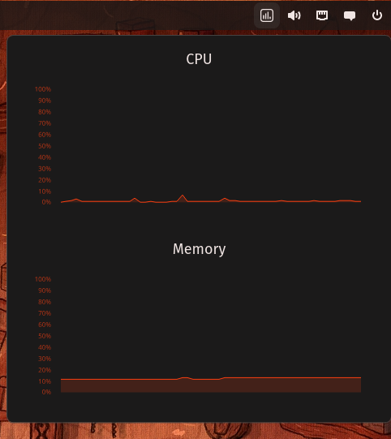

# SysStatus Cosmic Applet



Obs: this is very early work and I'm not fully working on that, so don't expect too much from this. 

## Installing
```sh
git clone https://github.com/aschiavon91/cosmic-applet-sys-status
cd cosmic-applet-sys-status
just install
```
